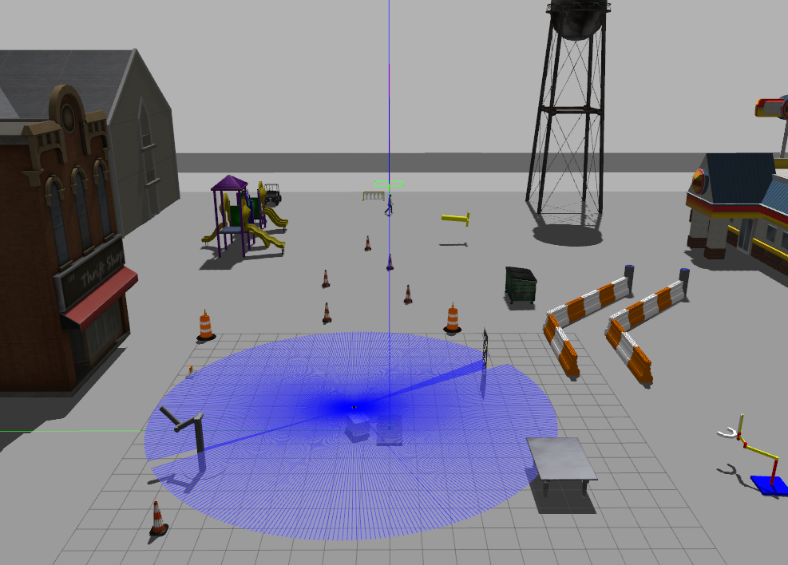

# ZebraT-Simulator
An ROS Simulator for an Autonomous Delivery Robot ZebraT

# How to Use
1. Git clone the zebrat package to you ROS workspace.
2. Make this package under the workspace namespace.
`catkin_make ` to compile it and use `rospack profile` to update package list.
3. Test with `roslaunch zebrat zebrat_with_world.launch`
4. Expected result:
 

5. Keyboard Control `rosrun zebrat keyboard_teleop.py`
6. Change Gazebo world in `/launch/zebrat_with_world.launch`
7. Change sensors in `/urdf/zebrat.urdf.xacro`
8. Test your own tasks.

# Paper
"Design and Implement an Enhanced Simulator for Autonomous Delivery Robot" MetroCAD 2022.
